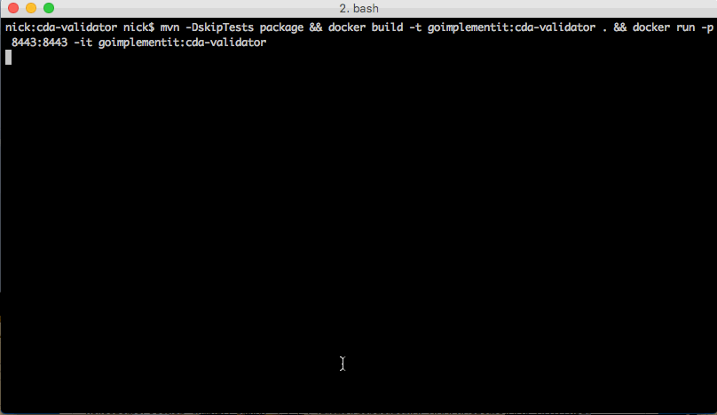

# README
This project contains a service that is able to validate:

 * CDA documents according to the HL7 CDA R2 standard
 * CDA documents according to the MedCom profiles QFDD, QRD, QPD and PHMR with danish adaptions

Furthermore the project contains a simple Angular 7 client for the service.

## How to build

Simply run:

~~~
./mvnw clean package
~~~

In order to build the service, deploy the servlet to any Java EE compliant server and you're good to go. The servlet is self-contained and holds no state.

## How to build and deploy with docker

The project comes with a Dockerfile based the official tomcat docker image from dockerhub.
To deploy the the project via the Dockerfile, simply use the following commands:

~~~
./mvnw clean package
docker build -t goimplementit:cda-validator .
docker run -p 8080:8080 -it goimplementit:cda-validator
~~~

or just run the one liner in the project root:

~~~
./mvnw clean package && docker build -t goimplementit:cda-validator . && docker run -p 8080:8080 -it goimplementit:cda-validator
~~~

Now you can use the service via your favorite HTTP client:

~~~
curl http://localhost:8080/validator/service/CDA/types
~~~

The service comes with a simple TLS/SSL Tomcat configuration for local use only. If you would like to use the Docker image in a production context, then please modify the configuration in `tomcat/conf/server.xml` and put your certificates in the `tomcat/conf` folder.

Build the Dockerfile again, and expose port 8443 when using docker run:

~~~
docker build -t goimplementit:cda-validator .
docker run -p 8443:8443 -it goimplementit:cda-validator
~~~

Depending on you certificates you should again be able to use your favorite HTTP client:

~~~
curl https://localhost:8443/validator/service/CDA/types
~~~

The web site is now available at http://localhost:8080/validator or https://localhost:8443/validator dependent on how you configured your Tomcat instance and which ports are exposed.
