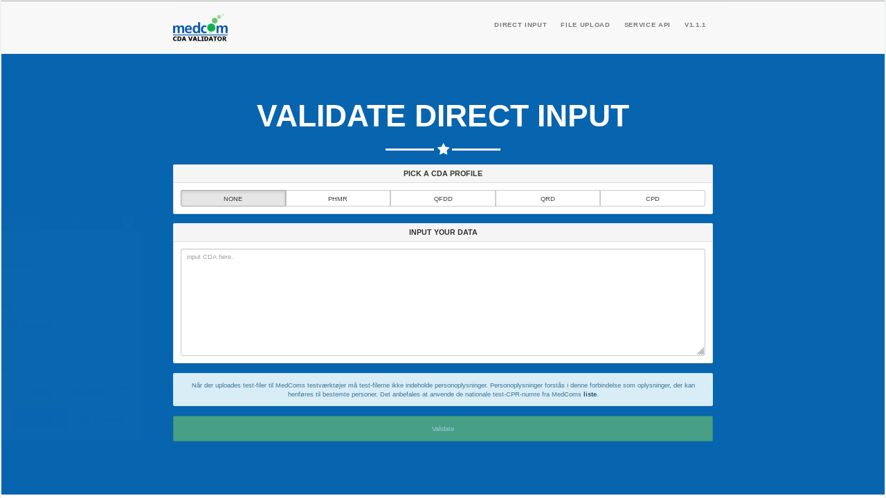
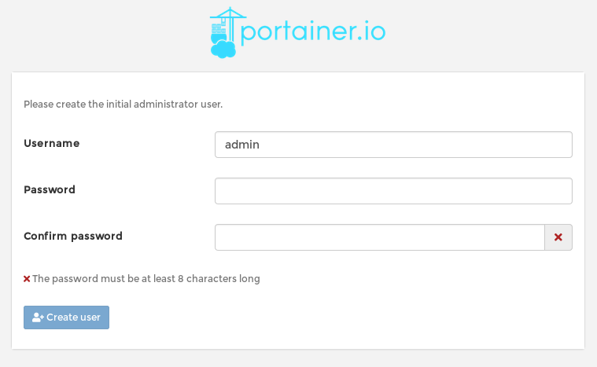
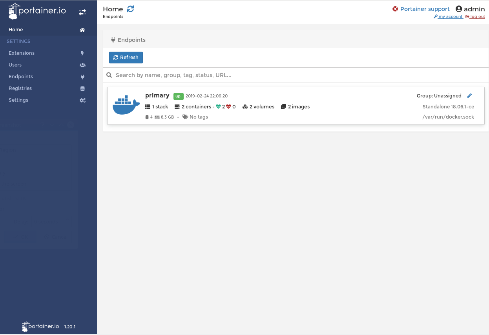
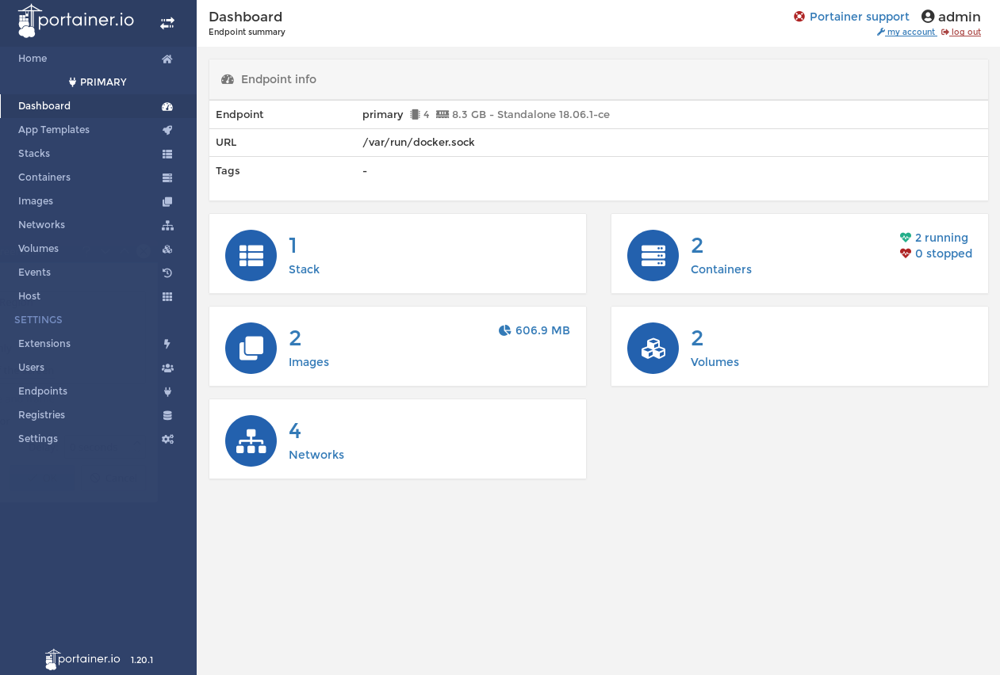
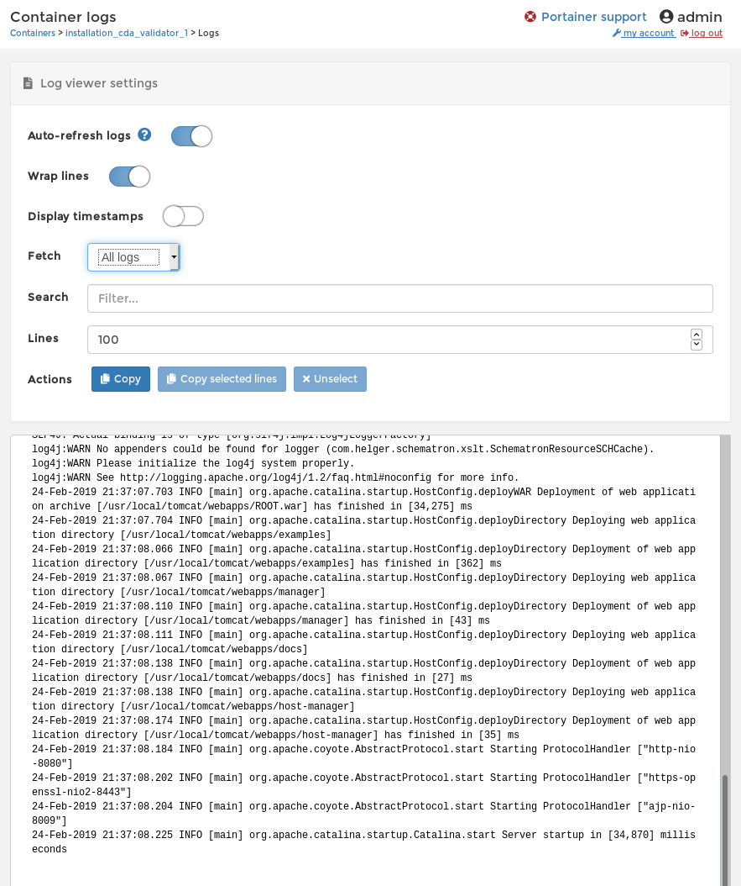
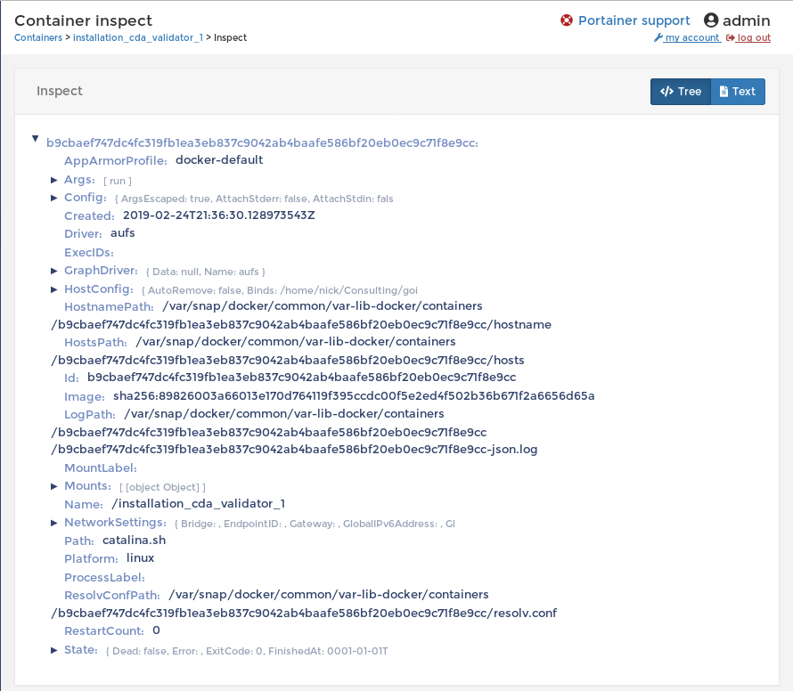
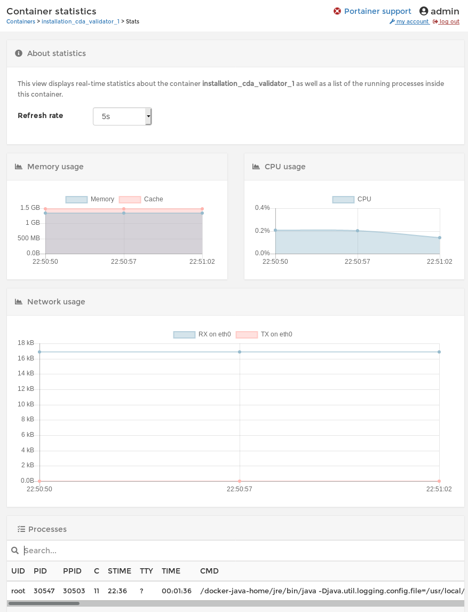

# Installation Guide

The following document describes how to install the CDA validator in a production environment. 

The CDA validator is published to hub.docker.com on the following URL:

https://hub.docker.com/r/goimplementit/cda-validator

The following guide assumes that the production environment has access to hub.docker.com.

Furthermore the guide assumes that the linux server has the following tools installed:

* docker
* docker-compose

## Install on a single server using docker-compose

The easiest way to install the CDA validator is by using the included  docker-compose.yml file. The file is located in the installation folder in the git repository of the validator. The repository can be found on the following URL: https://bitbucket.org/4s/cda-validator. 

First you need to transfer the installation folder from this repo to the server. You can simply do this by using wget on the linux server:

```
wget https://bitbucket.org/4s/cda-validator/downloads/install.zip
```

Unzip it to a directory of your liking and go to the newly created `install` folder:

```
unzip install.zip
cd install
```

The folder contains the following files:

```
.
├── docker-compose.yml
├── INSTALL.md
└── tomcat
    └── server.xml
```

The purpose these files and folders are described in the following table: 

| File or Folder     | Description                                                              |
---------------------|--------------------------------------------------------------------------|
| docker-compose.yml | The Compose file is an YAML file defining services, networks and volumes. In this case it defines two services and one volume. |
| INSTALL.md         | The following installation guide in markdown format. The markdown format makes it possible to read this guide from a linux terminal using common terminal tools like less, cat, more etc. |
| tomcat             | Tomcat specific configurations. Currently the folder only contains a server.xml file, which will be used for running the tomcat hosting the CDA validator. | 

In order to install the CDA validator on the server one simply needs to execute the following command:

```
docker-compose up -d
```

This starts the CDA validator and exposes it on port 8080. Moreover it starts a simple docker monitoring and administration tool called Portainer on port 9000. 

To test the installation you may visit port 8080 on your server via a normal web-browser, giving you a page like the one shown below:



In order to shutdown the CDA validator again one executes the following command:

```
docker-compose down
```

## Monitoring your docker setup

As briefly mentioned, the CDA validator is bundled with a monitoring and administration tool called Portainer. More information about the tool can be found on https://www.portainer.io/. In the following a short introduction to Portainer will be given with special focus on monitoring the CDA validator installation.

Portainer is a web frontend, meaning that to use it you need to use a web browser and navigate to port 9000 of the server on which you ran `docker-compose up -d`.

The first time you start up Portainer, you are asked to create an administrative user, which will then afterwards be used when using Portainer. It should present you with the following page:



When logged into Portainer you should see the portainer home containing one element called `primary`:



`primary` basically corresponds to the linux server we have installed the CDA validator on. When clicking on this you will see the portainer dashboard for our installation:



In short the elements of the dashboard describe the following:

| Item        | Description                                   
|-------------|-----------------------------------------------
| Stack       | A stack basically represents a set of applications started together. In this case we have one stack called `installation` representing the CDA validator and the Portainer applications.
| Images      | All docker images stored locally by the servers docker daemon.
| Networks    | All docker networks defined by the servers docker daemon.
| Containers  | A docker image can be started as a container. The following section describes all containers stored by the server's docker daemon. You should have two running containers, one for the CDA validator and one for Portainer.
| Volumes     | Mechanism for persisting data generated by and used by Docker containers. Expect one volume containing the Portainer data, like the password you entered when starting portainer for the first time.

In the context of monitoring the CDA validator, the items of interest are the containers, especially the running containers:


`installation_cda_validator_1` represents the running instance of the CDA validator. Next to it you have a number of quick actions which from left to right are the following:

* Logs
* Inspect
* Stats
* Console

The following will elaborate on the these quick actions.

### Logs
Enables you to view standard out from the docker container. More specifically the docker image with the CDA validator outputs both the catalina.out and the application logs, meaning both are visible in the logs view. Furthermore notice the interface auto refreshes.



### Inspect
Docker specific data about the CDA validator deployment.



### Stats
Monitor the memory consumption, CPU usage and network load with respect to the CDA validator. Again notice the interface auto refreshes.



### Console
Connect to the container and browse it using a terminal. Useful in debugging scenarios.


